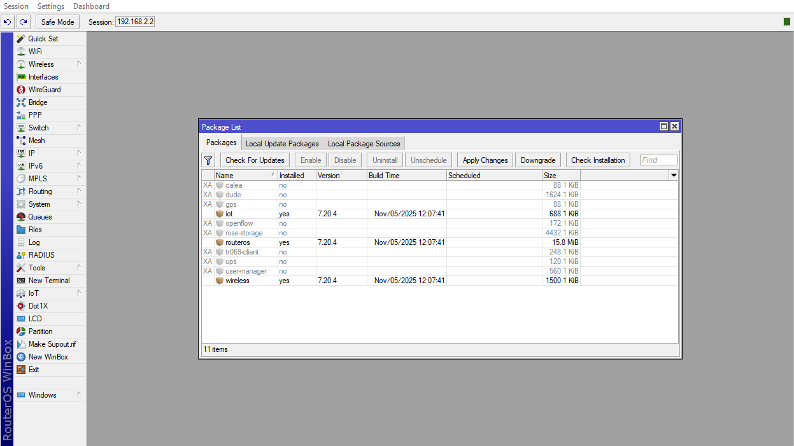
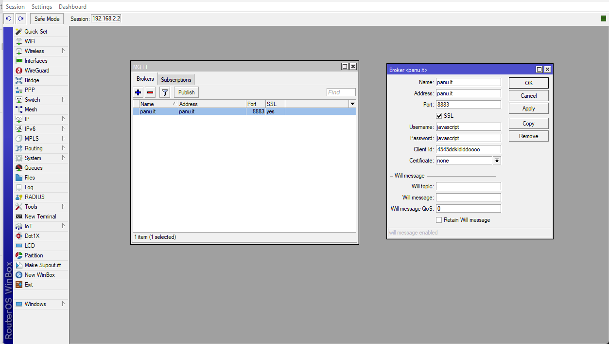
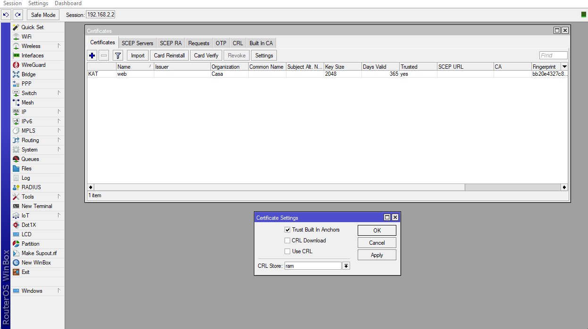
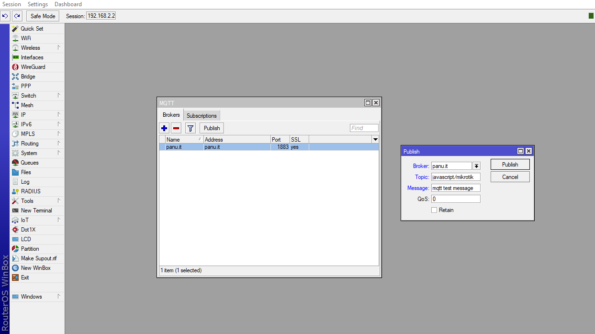
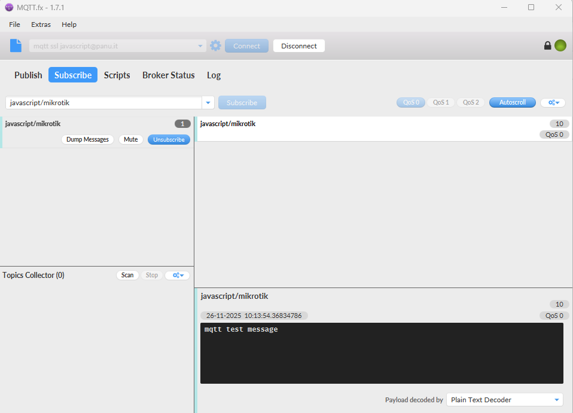
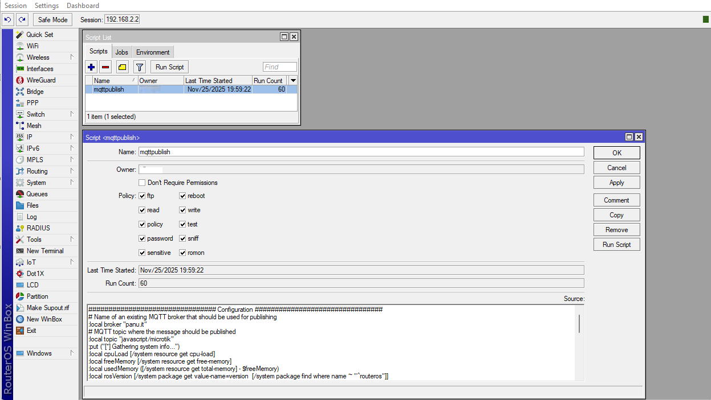
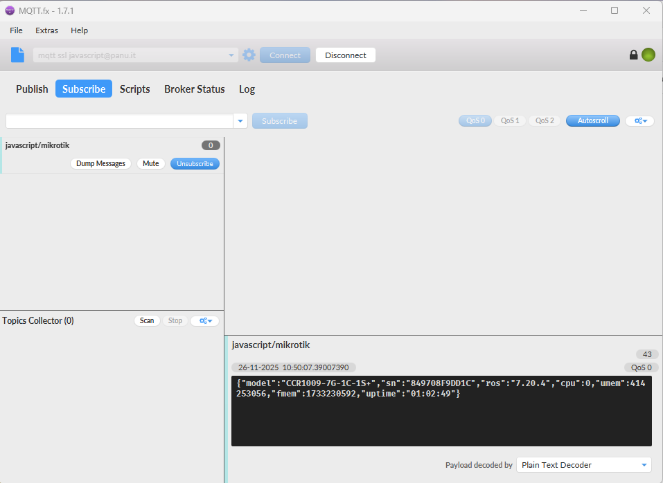
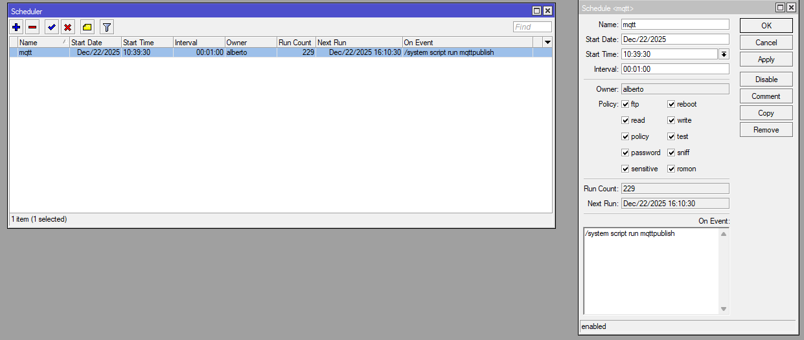
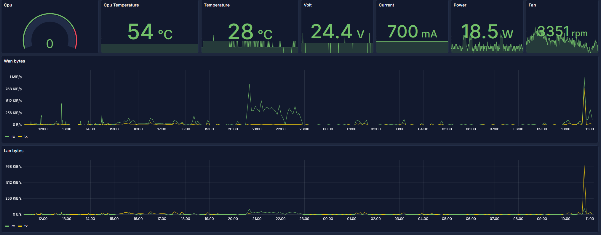

# How connect MikroTik routers to Mqtt broker, read data with Telegraf, insert them in Influxdb and display with grafana.
## original document https://help.mikrotik.com/docs/spaces/ROS/pages/46759978/MQTT
# Mikrotik router config 
* Install the iot package, from the System/Packages menu.

* The installation will restart the router.
* In the IoT/MQTT menu add a broker.

* If your broker has SSL and a cert root signed SSL certificate you can enable it, but you need trust the root certificates for many common certificate authorities in the System/certificate/settings menu.

* Test the mqtt broker connection publish something.


* You can add a script to publish router info to the mqtt broker.

* Run the script and get the result


mqttpublish script content

```
################################ Configuration ################################
# Name of an existing MQTT broker that should be used for publishing
:local broker "panu.it"

# MQTT topic where the message should be published
:local topic "microtik/firewallname"
:put ("[*] Gathering system info...")
:local cpuLoad [/system resource get cpu-load]
:local freeMemory [/system resource get free-memory]
:local usedMemory ([/system resource get total-memory] - $freeMemory)
:local rosVersion [/system package get value-name=version  [/system package find where name ~ "^routeros"]]
:local model [/system routerboard get value-name=model]
:local serialNumber [/system routerboard get value-name=serial-number]
:local upTime [/system resource get uptime]

:local m 1048576

:local WANtx [/interface/get WAN tx-byte]
:local WANrx [/interface/get WAN rx-byte]
:local LANtx [/interface/get LAN tx-byte]
:local LANrx [/interface/get LAN rx-byte]
:local DEMILtx [/interface/get DEMIL tx-byte]
:local DEMILrx [/interface/get DEMIL rx-byte]
:local BOXtx [/interface/get BOX tx-byte]
:local BOXrx [/interface/get BOX rx-byte]
:local wg1tx [/interface/get wg1 tx-byte]
:local wg1rx [/interface/get wg1 rx-byte]

#################################### MQTT #####################################
:local message \
"{\
    \"location\":\"whereisit\",\
    \"model\":\"$model\",\
    \"sn\":\"$serialNumber\",\
    \"ros\":\"$rosVersion\",\
    \"cpu\":$cpuLoad,\
    \"umem\":$usedMemory,\
    \"fmem\":$freeMemory,\
    \"uptime\":\"$upTime\",\
    \"WANtx\":$WANtx,\
    \"WANrx\":$WANrx,\
    \"LANtx\":$LANtx,\
    \"LANrx\":$LANrx,\
    \"DEMILtx\":$DEMILtx,\
    \"DEMILrx\":$DEMILrx,\
    \"BOXtx\":$BOXtx,\
    \"BOXrx\":$BOXrx,\
    \"wg1tx\":$wg1tx,\
    \"wg1rx\":$wg1rx\
}"

#:log info "$message";
:put ("[*] Total message size: $[:len $message] bytes")
:put ("[*] Sending message to MQTT broker...")
iot mqtt publish broker=$broker topic=$topic message=$message
:put ("[*] Done")
# for debug purpose
#:put $message
```

and add it to the system/scheduler



whith the On Event content

```
/system script run mqttpublish
```

# Telegraf

add the file mikrotik.conf on the /etc/telegraf/telegraf.d/

```
[[inputs.mqtt_consumer]]
#servers = ["tcp://127.0.0.1:1883"]
servers = ["panu.it:1883"]
topics = [
  "microtik/#"
]
tag_keys = [
  "location",
  "model",
  "sn",
  "ros"
]
name_override = "mikrotik"
username = "user"
password = "password"
```

# Grafana

https://grafana.panu.it/d/adq7pbn/routers?orgId=1&from=now-6h&to=now&timezone=browser&refresh=30s



you can import my graph or create a new one, but you must setup your datasource

```
{
  "annotations": {
    "list": [
      {
        "builtIn": 1,
        "datasource": {
          "type": "grafana",
          "uid": "-- Grafana --"
        },
        "enable": true,
        "hide": true,
        "iconColor": "rgba(0, 211, 255, 1)",
        "name": "Annotations & Alerts",
        "type": "dashboard"
      }
    ]
  },
  "editable": true,
  "fiscalYearStartMonth": 0,
  "graphTooltip": 0,
  "id": 0,
  "links": [],
  "panels": [
    {
      "datasource": {
        "type": "influxdb",
        "uid": "000000004"
      },
      "fieldConfig": {
        "defaults": {
          "color": {
            "mode": "thresholds"
          },
          "mappings": [],
          "thresholds": {
            "mode": "absolute",
            "steps": [
              {
                "color": "green",
                "value": 0
              },
              {
                "color": "red",
                "value": 80
              }
            ]
          }
        },
        "overrides": []
      },
      "gridPos": {
        "h": 5,
        "w": 4,
        "x": 0,
        "y": 0
      },
      "id": 6,
      "options": {
        "minVizHeight": 75,
        "minVizWidth": 75,
        "orientation": "auto",
        "reduceOptions": {
          "calcs": [
            "lastNotNull"
          ],
          "fields": "",
          "values": false
        },
        "showThresholdLabels": false,
        "showThresholdMarkers": true,
        "sizing": "auto"
      },
      "pluginVersion": "12.3.1",
      "targets": [
        {
          "datasource": {
            "type": "influxdb",
            "uid": "000000004"
          },
          "groupBy": [
            {
              "params": [
                "$__interval"
              ],
              "type": "time"
            },
            {
              "params": [
                "null"
              ],
              "type": "fill"
            }
          ],
          "measurement": "mikrotik",
          "orderByTime": "ASC",
          "policy": "default",
          "refId": "A",
          "resultFormat": "time_series",
          "select": [
            [
              {
                "params": [
                  "cpu"
                ],
                "type": "field"
              },
              {
                "params": [],
                "type": "last"
              }
            ]
          ],
          "tags": [
            {
              "key": "location::tag",
              "operator": "=",
              "value": "casa"
            }
          ]
        }
      ],
      "title": "Cpu",
      "type": "gauge"
    },
    {
      "datasource": {
        "type": "influxdb",
        "uid": "000000004"
      },
      "fieldConfig": {
        "defaults": {
          "color": {
            "mode": "palette-classic"
          },
          "custom": {
            "axisBorderShow": false,
            "axisCenteredZero": false,
            "axisColorMode": "text",
            "axisLabel": "",
            "axisPlacement": "auto",
            "barAlignment": 0,
            "barWidthFactor": 0.6,
            "drawStyle": "line",
            "fillOpacity": 0,
            "gradientMode": "none",
            "hideFrom": {
              "legend": false,
              "tooltip": false,
              "viz": false
            },
            "insertNulls": false,
            "lineInterpolation": "linear",
            "lineWidth": 1,
            "pointSize": 5,
            "scaleDistribution": {
              "type": "linear"
            },
            "showPoints": "auto",
            "showValues": false,
            "spanNulls": false,
            "stacking": {
              "group": "A",
              "mode": "none"
            },
            "thresholdsStyle": {
              "mode": "off"
            }
          },
          "mappings": [],
          "thresholds": {
            "mode": "absolute",
            "steps": [
              {
                "color": "green",
                "value": 0
              },
              {
                "color": "red",
                "value": 80
              }
            ]
          },
          "unit": "bytes"
        },
        "overrides": []
      },
      "gridPos": {
        "h": 8,
        "w": 24,
        "x": 0,
        "y": 5
      },
      "id": 7,
      "options": {
        "legend": {
          "calcs": [],
          "displayMode": "list",
          "placement": "bottom",
          "showLegend": true
        },
        "tooltip": {
          "hideZeros": false,
          "mode": "single",
          "sort": "none"
        }
      },
      "pluginVersion": "12.3.1",
      "targets": [
        {
          "alias": "$col",
          "datasource": {
            "type": "influxdb",
            "uid": "000000004"
          },
          "groupBy": [
            {
              "params": [
                "$__interval"
              ],
              "type": "time"
            },
            {
              "params": [
                "null"
              ],
              "type": "fill"
            }
          ],
          "measurement": "mikrotik",
          "orderByTime": "ASC",
          "policy": "autogen",
          "query": "SELECT non_negative_derivative(mean(\"WANrx\"), $__interval) AS \"rx\", non_negative_derivative(mean(\"WANtx\"), $__interval) AS \"tx\" FROM \"autogen\".\"mikrotik\" WHERE (\"location\"::tag = 'casa') AND $timeFilter GROUP BY time($__interval) fill(null)",
          "rawQuery": true,
          "refId": "A",
          "resultFormat": "time_series",
          "select": [
            [
              {
                "params": [
                  "WANrx"
                ],
                "type": "field"
              },
              {
                "params": [],
                "type": "mean"
              },
              {
                "params": [
                  "1m"
                ],
                "type": "non_negative_derivative"
              },
              {
                "params": [
                  "rx"
                ],
                "type": "alias"
              }
            ],
            [
              {
                "params": [
                  "WANtx"
                ],
                "type": "field"
              },
              {
                "params": [],
                "type": "mean"
              },
              {
                "params": [
                  "1m"
                ],
                "type": "non_negative_derivative"
              },
              {
                "params": [
                  "tx"
                ],
                "type": "alias"
              }
            ]
          ],
          "tags": [
            {
              "key": "location::tag",
              "operator": "=",
              "value": "casa"
            }
          ]
        }
      ],
      "title": "Wan Mb",
      "type": "timeseries"
    },
    {
      "datasource": {
        "type": "influxdb",
        "uid": "000000004"
      },
      "fieldConfig": {
        "defaults": {
          "color": {
            "mode": "palette-classic"
          },
          "custom": {
            "axisBorderShow": false,
            "axisCenteredZero": false,
            "axisColorMode": "text",
            "axisLabel": "",
            "axisPlacement": "auto",
            "barAlignment": 0,
            "barWidthFactor": 0.6,
            "drawStyle": "line",
            "fillOpacity": 0,
            "gradientMode": "none",
            "hideFrom": {
              "legend": false,
              "tooltip": false,
              "viz": false
            },
            "insertNulls": false,
            "lineInterpolation": "linear",
            "lineWidth": 1,
            "pointSize": 5,
            "scaleDistribution": {
              "type": "linear"
            },
            "showPoints": "auto",
            "showValues": false,
            "spanNulls": false,
            "stacking": {
              "group": "A",
              "mode": "none"
            },
            "thresholdsStyle": {
              "mode": "off"
            }
          },
          "mappings": [],
          "thresholds": {
            "mode": "absolute",
            "steps": [
              {
                "color": "green",
                "value": 0
              },
              {
                "color": "red",
                "value": 80
              }
            ]
          },
          "unit": "bytes"
        },
        "overrides": []
      },
      "gridPos": {
        "h": 8,
        "w": 24,
        "x": 0,
        "y": 13
      },
      "id": 2,
      "options": {
        "legend": {
          "calcs": [],
          "displayMode": "list",
          "placement": "bottom",
          "showLegend": true
        },
        "tooltip": {
          "hideZeros": false,
          "mode": "single",
          "sort": "none"
        }
      },
      "pluginVersion": "12.3.1",
      "targets": [
        {
          "alias": "$col",
          "datasource": {
            "type": "influxdb",
            "uid": "000000004"
          },
          "groupBy": [
            {
              "params": [
                "$__interval"
              ],
              "type": "time"
            },
            {
              "params": [
                "null"
              ],
              "type": "fill"
            }
          ],
          "measurement": "mikrotik",
          "orderByTime": "ASC",
          "policy": "autogen",
          "query": "SELECT non_negative_derivative(mean(\"LANrx\"), $__interval) AS \"rx\", non_negative_derivative(mean(\"LANtx\"), $__interval) AS \"tx\" FROM \"autogen\".\"mikrotik\" WHERE (\"location\"::tag = 'casa') AND $timeFilter GROUP BY time($__interval) fill(null)",
          "rawQuery": true,
          "refId": "A",
          "resultFormat": "time_series",
          "select": [
            [
              {
                "params": [
                  "LANrx"
                ],
                "type": "field"
              },
              {
                "params": [],
                "type": "mean"
              },
              {
                "params": [
                  "1m"
                ],
                "type": "non_negative_derivative"
              },
              {
                "params": [
                  "rx"
                ],
                "type": "alias"
              }
            ],
            [
              {
                "params": [
                  "LANtx"
                ],
                "type": "field"
              },
              {
                "params": [],
                "type": "mean"
              },
              {
                "params": [
                  "1m"
                ],
                "type": "non_negative_derivative"
              },
              {
                "params": [
                  "tx"
                ],
                "type": "alias"
              }
            ]
          ],
          "tags": [
            {
              "key": "location::tag",
              "operator": "=",
              "value": "casa"
            }
          ]
        }
      ],
      "title": "Lan Mb",
      "type": "timeseries"
    },
    {
      "datasource": {
        "type": "influxdb",
        "uid": "000000004"
      },
      "fieldConfig": {
        "defaults": {
          "color": {
            "mode": "palette-classic"
          },
          "custom": {
            "axisBorderShow": false,
            "axisCenteredZero": false,
            "axisColorMode": "text",
            "axisLabel": "",
            "axisPlacement": "auto",
            "barAlignment": 0,
            "barWidthFactor": 0.6,
            "drawStyle": "line",
            "fillOpacity": 0,
            "gradientMode": "none",
            "hideFrom": {
              "legend": false,
              "tooltip": false,
              "viz": false
            },
            "insertNulls": false,
            "lineInterpolation": "linear",
            "lineWidth": 1,
            "pointSize": 5,
            "scaleDistribution": {
              "type": "linear"
            },
            "showPoints": "auto",
            "showValues": false,
            "spanNulls": false,
            "stacking": {
              "group": "A",
              "mode": "none"
            },
            "thresholdsStyle": {
              "mode": "off"
            }
          },
          "mappings": [],
          "thresholds": {
            "mode": "absolute",
            "steps": [
              {
                "color": "green",
                "value": 0
              },
              {
                "color": "red",
                "value": 80
              }
            ]
          },
          "unit": "bytes"
        },
        "overrides": []
      },
      "gridPos": {
        "h": 8,
        "w": 24,
        "x": 0,
        "y": 21
      },
      "id": 3,
      "options": {
        "legend": {
          "calcs": [],
          "displayMode": "list",
          "placement": "bottom",
          "showLegend": true
        },
        "tooltip": {
          "hideZeros": false,
          "mode": "single",
          "sort": "none"
        }
      },
      "pluginVersion": "12.3.1",
      "targets": [
        {
          "alias": "$col",
          "datasource": {
            "type": "influxdb",
            "uid": "000000004"
          },
          "groupBy": [
            {
              "params": [
                "$__interval"
              ],
              "type": "time"
            },
            {
              "params": [
                "null"
              ],
              "type": "fill"
            }
          ],
          "measurement": "mikrotik",
          "orderByTime": "ASC",
          "policy": "autogen",
          "query": "SELECT non_negative_derivative(mean(\"BOXrx\"), $__interval) AS \"rx\", non_negative_derivative(mean(\"BOXtx\"), $__interval) AS \"tx\" FROM \"autogen\".\"mikrotik\" WHERE (\"location\"::tag = 'casa') AND $timeFilter GROUP BY time($__interval) fill(null)",
          "rawQuery": true,
          "refId": "A",
          "resultFormat": "time_series",
          "select": [
            [
              {
                "params": [
                  "BOXrx"
                ],
                "type": "field"
              },
              {
                "params": [],
                "type": "mean"
              },
              {
                "params": [
                  "1m"
                ],
                "type": "non_negative_derivative"
              },
              {
                "params": [
                  "rx"
                ],
                "type": "alias"
              }
            ],
            [
              {
                "params": [
                  "BOXtx"
                ],
                "type": "field"
              },
              {
                "params": [],
                "type": "mean"
              },
              {
                "params": [
                  "1m"
                ],
                "type": "non_negative_derivative"
              },
              {
                "params": [
                  "tx"
                ],
                "type": "alias"
              }
            ]
          ],
          "tags": [
            {
              "key": "location::tag",
              "operator": "=",
              "value": "casa"
            }
          ]
        }
      ],
      "title": "Down Mb",
      "type": "timeseries"
    },
    {
      "datasource": {
        "type": "influxdb",
        "uid": "000000004"
      },
      "fieldConfig": {
        "defaults": {
          "color": {
            "mode": "palette-classic"
          },
          "custom": {
            "axisBorderShow": false,
            "axisCenteredZero": false,
            "axisColorMode": "text",
            "axisLabel": "",
            "axisPlacement": "auto",
            "barAlignment": 0,
            "barWidthFactor": 0.6,
            "drawStyle": "line",
            "fillOpacity": 0,
            "gradientMode": "none",
            "hideFrom": {
              "legend": false,
              "tooltip": false,
              "viz": false
            },
            "insertNulls": false,
            "lineInterpolation": "linear",
            "lineWidth": 1,
            "pointSize": 5,
            "scaleDistribution": {
              "type": "linear"
            },
            "showPoints": "auto",
            "showValues": false,
            "spanNulls": false,
            "stacking": {
              "group": "A",
              "mode": "none"
            },
            "thresholdsStyle": {
              "mode": "off"
            }
          },
          "mappings": [],
          "thresholds": {
            "mode": "absolute",
            "steps": [
              {
                "color": "green",
                "value": 0
              },
              {
                "color": "red",
                "value": 80
              }
            ]
          },
          "unit": "bytes"
        },
        "overrides": []
      },
      "gridPos": {
        "h": 8,
        "w": 24,
        "x": 0,
        "y": 29
      },
      "id": 4,
      "options": {
        "legend": {
          "calcs": [],
          "displayMode": "list",
          "placement": "bottom",
          "showLegend": true
        },
        "tooltip": {
          "hideZeros": false,
          "mode": "single",
          "sort": "none"
        }
      },
      "pluginVersion": "12.3.1",
      "targets": [
        {
          "alias": "$col",
          "datasource": {
            "type": "influxdb",
            "uid": "000000004"
          },
          "groupBy": [
            {
              "params": [
                "$__interval"
              ],
              "type": "time"
            },
            {
              "params": [
                "null"
              ],
              "type": "fill"
            }
          ],
          "measurement": "mikrotik",
          "orderByTime": "ASC",
          "policy": "autogen",
          "query": "SELECT non_negative_derivative(mean(\"DEMILrx\"), $__interval) AS \"rx\", non_negative_derivative(mean(\"DEMILtx\"), $__interval) AS \"tx\" FROM \"autogen\".\"mikrotik\" WHERE (\"location\"::tag = 'casa') AND $timeFilter GROUP BY time($__interval) fill(null)",
          "rawQuery": true,
          "refId": "A",
          "resultFormat": "time_series",
          "select": [
            [
              {
                "params": [
                  "DEMILrx"
                ],
                "type": "field"
              },
              {
                "params": [],
                "type": "mean"
              },
              {
                "params": [
                  "1m"
                ],
                "type": "non_negative_derivative"
              },
              {
                "params": [
                  "rx"
                ],
                "type": "alias"
              }
            ],
            [
              {
                "params": [
                  "DEMILtx"
                ],
                "type": "field"
              },
              {
                "params": [],
                "type": "mean"
              },
              {
                "params": [
                  "1m"
                ],
                "type": "non_negative_derivative"
              },
              {
                "params": [
                  "tx"
                ],
                "type": "alias"
              }
            ]
          ],
          "tags": [
            {
              "key": "location::tag",
              "operator": "=",
              "value": "casa"
            }
          ]
        }
      ],
      "title": "Demil Mb",
      "type": "timeseries"
    },
    {
      "datasource": {
        "type": "influxdb",
        "uid": "000000004"
      },
      "fieldConfig": {
        "defaults": {
          "color": {
            "mode": "palette-classic"
          },
          "custom": {
            "axisBorderShow": false,
            "axisCenteredZero": false,
            "axisColorMode": "text",
            "axisLabel": "",
            "axisPlacement": "auto",
            "barAlignment": 0,
            "barWidthFactor": 0.6,
            "drawStyle": "line",
            "fillOpacity": 0,
            "gradientMode": "none",
            "hideFrom": {
              "legend": false,
              "tooltip": false,
              "viz": false
            },
            "insertNulls": false,
            "lineInterpolation": "linear",
            "lineWidth": 1,
            "pointSize": 5,
            "scaleDistribution": {
              "type": "linear"
            },
            "showPoints": "auto",
            "showValues": false,
            "spanNulls": false,
            "stacking": {
              "group": "A",
              "mode": "none"
            },
            "thresholdsStyle": {
              "mode": "off"
            }
          },
          "mappings": [],
          "thresholds": {
            "mode": "absolute",
            "steps": [
              {
                "color": "green",
                "value": 0
              },
              {
                "color": "red",
                "value": 80
              }
            ]
          },
          "unit": "bytes"
        },
        "overrides": []
      },
      "gridPos": {
        "h": 8,
        "w": 24,
        "x": 0,
        "y": 37
      },
      "id": 5,
      "options": {
        "legend": {
          "calcs": [],
          "displayMode": "list",
          "placement": "bottom",
          "showLegend": true
        },
        "tooltip": {
          "hideZeros": false,
          "mode": "single",
          "sort": "none"
        }
      },
      "pluginVersion": "12.3.1",
      "targets": [
        {
          "alias": "$col",
          "datasource": {
            "type": "influxdb",
            "uid": "000000004"
          },
          "groupBy": [
            {
              "params": [
                "$__interval"
              ],
              "type": "time"
            },
            {
              "params": [
                "null"
              ],
              "type": "fill"
            }
          ],
          "measurement": "mikrotik",
          "orderByTime": "ASC",
          "policy": "autogen",
          "query": "SELECT non_negative_derivative(mean(\"wg1rx\"), $__interval) AS \"rx\", non_negative_derivative(mean(\"wg1rx\"), $__interval) AS \"tx\" FROM \"autogen\".\"mikrotik\" WHERE (\"location\"::tag = 'casa') AND $timeFilter GROUP BY time($__interval) fill(null)",
          "rawQuery": true,
          "refId": "A",
          "resultFormat": "time_series",
          "select": [
            [
              {
                "params": [
                  "wg1rx"
                ],
                "type": "field"
              },
              {
                "params": [],
                "type": "mean"
              },
              {
                "params": [
                  "1m"
                ],
                "type": "non_negative_derivative"
              },
              {
                "params": [
                  "rx"
                ],
                "type": "alias"
              }
            ],
            [
              {
                "params": [
                  "wg1rx"
                ],
                "type": "field"
              },
              {
                "params": [],
                "type": "mean"
              },
              {
                "params": [
                  "1m"
                ],
                "type": "non_negative_derivative"
              },
              {
                "params": [
                  "tx"
                ],
                "type": "alias"
              }
            ]
          ],
          "tags": [
            {
              "key": "location::tag",
              "operator": "=",
              "value": "casa"
            }
          ]
        }
      ],
      "title": "Vpn Mb",
      "type": "timeseries"
    }
  ],
  "preload": false,
  "refresh": "30s",
  "schemaVersion": 42,
  "tags": [],
  "templating": {
    "list": []
  },
  "time": {
    "from": "now-6h",
    "to": "now"
  },
  "timepicker": {},
  "timezone": "browser",
  "title": "Routers",
  "uid": "adq7pbn",
  "version": 40
}
```


